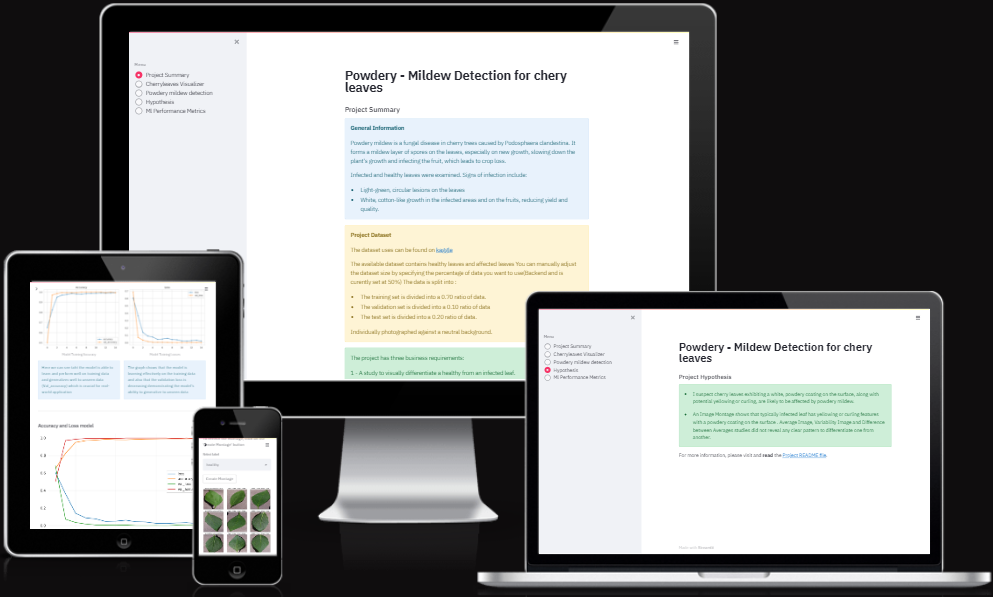

# 

## Table of Contents
1. 
2. 
3. 
4. 
5. 
6. 

### Deployed web aplication [''](https:///)

## Business Requirements

### Business Requirement 1: 

### Business Requirement 2: 

### Business Requirement 3:

## Dataset Content

## Hypothesis and validation

**1. Introduction**

**2. Observation**

**3. Conclusion**

**Sources**:

### The goal

### Model 

- **Loss**:

- **Optimizer**: 

- **Metrics**: 

## Trial and error
 
## Dashboard Design (Streamlit App User Interface)

## Bugs

### Fixed Bug

## Unfixed Bug

## Futre development

## Deployment
   
### Forking the Repository

### Making a local clone

## Technologies used

### Platforms

### Languages

### Main Data Analysis and Machine Learning Libraries

## Credits

### Content

### Media

### Code

### Acknowledgements
