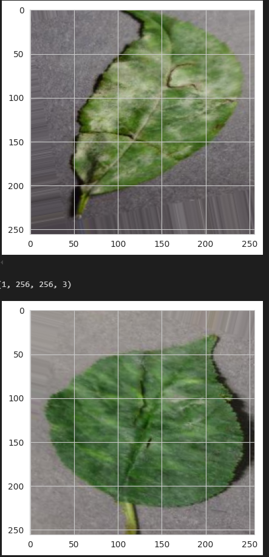

# 

### Deployed web aplication [Mildew Detection](https://pp5mildewdeiain-8e8f491a1401.herokuapp.com/)

## Table of Contents
1. 
2. 
3. 
4. 
5. 
6. 

## Business Requirements

### Business Requirement 1: 

The client is interested in conducting a study to visually differentiate a cherry leaf that is healthy from one that contains powdery mildew.

### Business Requirement 2: 

The client is interested in predicting if a cherry leaf is healthy or contains powdery mildew.

### Business Requirement 3:

We agreed with the client a degree of 97% accuracy.

### Business Requirement 4:

The client is interested in obtaining a prediction report of the examined leaves.

## Dashboard Design (Streamlit App User Interface)

### [Streamlit](https://streamlit.io/) was used to create the dashboard for easy uses and prenst data

#### Page One: Project Summary

The project summary page is the ladning page, it is the first page you will see. 
It in detail explains the General information, Project dataset and Business requirments.

#### Page Two: Cherryleaves Visualizer

On this page you can see the differences between average healthy and powdery-mildew leaves aswell as a image montage of healthy or powdery-mildew leaves.

#### Page Three: Powdery mildew detection

On this page you can dowload a photo from the link provided or if you have a picture of a cherry leaf you can drag and drop it onto the page, it will the give you a pridition of the leaf with a option to dowload a report of the prediction.

#### Page Three: Hypothesis

Here you will find a hypothesis of how to identify a healthy cherry leaf from a powdery-mildew leaf

#### Page Three: Ml Performance Metrics

This page has the perfomance of the model been used for the dashboard going into depth about the model and the performance of it.

## The goal

The goal is to meet all the buisness requirements aswell as display it in a format that is easaly readable to anyone using the dasboard but aswell as have a section for users who are more intrested of the indepth results of the model

## Dataset Content (for model v11)

1. The data was gatherd from [kaggle](https://www.kaggle.com/datasets/codeinstitute/cherry-leaves) and dowloaded into zipfolders that cosited of healthy leaf photos aswell as powdery-mildew photos.
I thenproceeded to unzip the folders first clean the data to insure I only have images and then deleted fifty percent of the data from both files and this was the rusult of the image count 

   - Folder: healthy - has 2104 image files
   - Folder: healthy - has 0 non-image files
   - Folder: powdery_mildew - has 2104 image files
   - Folder: powdery_mildew - has 0 non-image files
   - Folder: healthy - Deleted 1052 images based on 50% deletion.
   - Folder: powdery_mildew - Deleted 1052 images based on 50% deletion.
   - Folder: healthy - has 1052 images remaining
   - Folder: powdery_mildew - has 1052 images remaining

2. I split the data into train, valaidation and test sets as follows

   - The training set is divided into a 0.70 ratio of data.
   - The validation set is divided into a 0.10 ratio of data.
   - The test set is divided into a 0.20 ratio of data.

3. I then resized all the images 

   - Mean width of images: 256 
   - Mean height of images: 256

4. I then got the mean and variability of images per label

   - 

     
mean and variability:

     
     
     

     

5. I do a count of how many images there are in the tarin, test and validation stes.
   The count is as follow

   - Train - healthy: 736 images
   - Train - powdery_mildew: 736 images
   - Validation - healthy: 105 images
   - Validation - powdery_mildew: 105 images
   - Test - healthy: 211 images
   - Test - powdery_mildew: 211 images
   - 

     
Bar graph displaying the amount of images in each set:

     

     

6. I then agumented training and validation images in hopes the model will pick up on more paterns of the leaves.
   An example of this would look like this:

   - 

     
Bar graph displaying the amount of images in each set:

     

     

### Model 

- **Loss**:

- **Optimizer**: 

- **Metrics**: 

## Trial and error

## Hypothesis and validation

**1. Introduction**

**2. Observation**

**3. Conclusion**

## Bugs

### Fixed Bug

## Unfixed Bug

## Futre development

## Deployment
   
### Forking the Repository

### Making a local clone

## Technologies used

### Platforms

### Languages

### Main Data Analysis and Machine Learning Libraries

## Credits

### Content

### Media

### Code

### Acknowledgements

