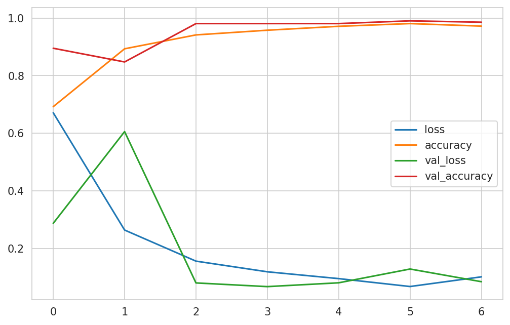

# 

### Deployed web aplication [Mildew Detection](https://pp5mildewdeiain-8e8f491a1401.herokuapp.com/)

## Table of Contents
1. 
2. 
3. 
4. 
5. 
6. 

## Business Requirements

The cherry plantation crop from Farmy & Foods is facing a challenge where their cherry plantations have been presenting powdery mildew. Currently, the process is manual verification if a given cherry tree contains powdery mildew. An employee spends around 30 minutes in each tree, taking a few samples of tree leaves and verifying visually if the leaf tree is healthy or has powdery mildew. If there is powdery mildew, the employee applies a specific compound to kill the fungus. The time spent applying this compound is 1 minute. The company has thousands of cherry trees located on multiple farms across the country. As a result, this manual process is not scalable due to the time spent in the manual process inspection.

To save time in this process, the IT team suggested an ML system that detects instantly, using a leaf tree image, if it is healthy or has powdery mildew. A similar manual process is in place for other crops for detecting pests, and if this initiative is successful, there is a realistic chance to replicate this project for all other crops. The dataset is a collection of cherry leaf images provided by Farmy & Foods, taken from their crops.

### Business Requirement 1: 

The client is interested in conducting a study to visually differentiate a cherry leaf that is healthy from one that contains powdery mildew.

### Business Requirement 2: 

The client is interested in predicting if a cherry leaf is healthy or contains powdery mildew.

### Business Requirement 3:

We agreed with the client a degree of 97% accuracy.

### Business Requirement 4:

The client is interested in obtaining a prediction report of the examined leaves.

## Dashboard Design (Streamlit App User Interface)

### [Streamlit](https://streamlit.io/) was used to create the dashboard for easy uses and prenst data

#### Page One: Project Summary

The project summary page is the ladning page, it is the first page you will see. 
It in detail explains the General information, Project dataset and Business requirments.

#### Page Two: Cherryleaves Visualizer

On this page you can see the differences between average healthy and powdery-mildew leaves aswell as a image montage of healthy or powdery-mildew leaves.

#### Page Three: Powdery mildew detection

On this page you can dowload a photo from the link provided or if you have a picture of a cherry leaf you can drag and drop it onto the page, it will the give you a pridition of the leaf with a option to dowload a report of the prediction.

#### Page Three: Hypothesis

Here you will find a hypothesis of how to identify a healthy cherry leaf from a powdery-mildew leaf

#### Page Three: Ml Performance Metrics

This page has the perfomance of the model been used for the dashboard going into depth about the model and the performance of it.

## The goal

The goal is to meet all the buisness requirements aswell as display it in a format that is easaly readable to anyone using the dasboard but aswell as have a section for users who are more intrested of the indepth results of the model

## Dataset Content (for model v11)

1. The data was gatherd from [kaggle](https://www.kaggle.com/datasets/codeinstitute/cherry-leaves) and dowloaded into zipfolders that cosited of healthy leaf photos aswell as powdery-mildew photos.
I thenproceeded to unzip the folders first clean the data to insure I only have images and then deleted fifty percent of the data from both files and this was the rusult of the image count 

   - Folder: healthy - has 2104 image files
   - Folder: healthy - has 0 non-image files
   - Folder: powdery_mildew - has 2104 image files
   - Folder: powdery_mildew - has 0 non-image files
   - Folder: healthy - Deleted 1052 images based on 50% deletion.
   - Folder: powdery_mildew - Deleted 1052 images based on 50% deletion.
   - Folder: healthy - has 1052 images remaining
   - Folder: powdery_mildew - has 1052 images remaining

2. I split the data into train, valaidation and test sets as follows

   - The training set is divided into a 0.70 ratio of data.
   - The validation set is divided into a 0.10 ratio of data.
   - The test set is divided into a 0.20 ratio of data.

3. I then resized all the images 

   - Mean width of images: 256 
   - Mean height of images: 256

4. I then got the mean and variability of images per label

   - 

     
mean and variability:

     
     
     

     

5. I do a count of how many images there are in the tarin, test and validation stes.
   The count is as follow

   - Train - healthy: 736 images
   - Train - powdery_mildew: 736 images
   - Validation - healthy: 105 images
   - Validation - powdery_mildew: 105 images
   - Test - healthy: 211 images
   - Test - powdery_mildew: 211 images
   - 

     
Bar graph displaying the amount of images in each set:

     

     

6. I then agumented training and validation images in hopes the model will pick up on more paterns of the leaves.
   An example of this would look like this:

   - 

     
Example of Agumented images

     

     

## Model (V11)

The model shows rapid improvement for both loss and accuracy within the first few epochs, the model then achives and maintains high accuracy and low loss indecating effective learning and good generalization whithout 
overfitting

Here is a Graph pf the model

**Loss**

  - The model shows a reapid reduction in traing and validation losses int he first few epochs indecating that the model is learning efectively
  - The model losses then remains close to zero after the first few epochs showing that the model in not overfitting
  - The model losses stabelizes but there are some sings of fluctuctuation wich indicats some overfitting but not significant enough for me to deem this model not acceptable 
  - Overall the model demostrates excellent performance with low value losses 
  - 

    
Here is a Graph pf the models training losses

    

    

**Accuracy**

  - The model shows rapid increase in accuracy in both validation and traing within the firs few epochs
  - There is no significant overfitting as the modeld stabilazes quickly with high accuaracy
  - The close alingment of both trainig and validation sugest good performance of the model
  - Overall the model shows excelent accuracy and high perfomance as well as mainaining this troughout the process
  - 

    
Here is a Graph pf the models training accuracy

    

    

**Confusion Matrix**

Here we can see the model is highly accurate, correctly predicting a vast majority of instances in both classes. There are very few errors (Only two false negatives and no false positives) 

 - 

    
Here is the Cofusion Matrix reults

    

    

**Optimizer** 

I used SGD as the optomizer fot this model as I have found better results using it, this the code I usesd.
For the loss I went wit binary_crossentopy with metrics as ccuaracy

  - 

    
Code Snippit of optimizer

    

    

**Model Code explenation**

- For this model(v11) I have used five convolutional starting of with 16 filters increasing is size I found that this would stabelize the model.
- This model has a dropout set to 0.5 wich prevents too much overfittig or underfitting of this moddel
- A batch size of one was used
- Patience was set to 3 to insure the model would stop at the right time to prevent overfitting
- This model dense was set at 128 I found better performans at this value

 - 

    
Code Snippits of the model

    
    
    

    

## Trial and error

When creating this model it did not come without complicatition (Overfittin then underfitting) this is the elevnth model trhou trail and error is these only way I have acheved thes results I have used three difrent optomizers adam, RMS porp and SGD.
I have also used difrent patciance values, densety values aswel as difrent convolutional lairs.

At first I ran a few models but found I did not realy understand how the model was performing in regards to the relation to accuracy and value loss aswell as what classes it should improve on to solve this I have added more graphs to display the results in a better more readable way for me to see what the model is actualy dong and how I could improve on it.

Here is how each model performed :

  - 

    
v1

    
    

    

  - 

    
v2

    
    

    

  - 

    
v3

    
    

    

  - 

    
v4

    
    
    

    

  - 

    
v5

    
    
    

    

  - 

    
v6

    
    
    
    

    

  - 

    
v7

    
    
    
    

    

  - 

    
v8

    
    
    
    

    

  - 

    
v9

    
    
    
    

    

  - 

    
v10

    
    
    
    

    

  - 

    
v11

    
    
    
    

    

    

## Hypothesis and validation

The model is well tuned and effectively balanced

It simultaneously shows a decrease and low final values for both validation and training losses, alongside with close alignment of the curves

The model has successfully learned the patterns in the training set and can generalize these patterns to unseen validation data without overfitting

The model has a general performance of 99.53%

# 

# Manual Testing

| What was tested | Result | Outcome |
|:---:|:---:|:---:|
|Clicked on the radio buttons in the menu|Changed to the desired page|Works as intended|
|Clicked the close button on the menu|Hides the menu|Works as intended|
|Cliked the links on evry page |directs you to the desired page|Works as intended|
|Cliked on all three check boxes|displayd inteded content|Works as intended|
|Draged and droped a image on desegnated area|Predicted the images corectly|Works as intended|
|Cliked on the dowload report link| Opend a excel spreadsheet with the report|works as intended|
|Draged and droped more than one image|Predicts images corectly |works as intended|

## Bugs

1. On model v5 there is a bug where the confusion matrix does not display corectly as this was the first implimantastion of it I did and fixed it for futre models
 - 

    
Here you can see it is displaying incorectly (Model v5)

    
    

    

2. I would not describe this as a bug but as an isuue that can be attended to in the futre, I found evrytime I made a new model I could have created a global variable where I can change the version on one place rather than have to change it indevidualy at multiple difrent places 

3. I wanted to run another model v12 but after doig all the data colection and preporation I have decided against it the image motage is loaded from the  

## Futre development

For futre development there are a few idias that could be cosidred:

1. Create a dropdwon to not ony identify chery leaves but aswell as other crops for the farmer
2. Create database when multiple users start loging on and using the webb aplication it will grow the database and in return train the model more efectivley
 
## Deployment

### Heroku

- The App live link is: `https://YOUR_APP_NAME.herokuapp.com/`
- Set the runtime.txt Python version to a [Heroku-20](https://devcenter.heroku.com/articles/python-support#supported-runtimes) stack currently supported version.
- The project was deployed to Heroku using the following steps.

1. Log in to Heroku and create an App
2. At the Deploy tab, select GitHub as the deployment method.
3. Select your repository name and click Search. Once it is found, click Connect.
4. Select the branch you want to deploy, then click Deploy Branch.
5. The deployment process should happen smoothly if all deployment files are fully functional. Click the button Open App on the top of the page to access your App.
6. If the slug size is too large, then add large files not required for the app to the .slugignore file.

## _Cloning the GitHub repository_

This will download a full copy to your desktop

1. Log into GitHub
2. Find the repository you wish to clone
3. Find the green code button top right corner
4. Select "Local", copy the HTTPS URL
5. Go to Codeanywhere and navigate to "New Workspace"
6. Paste the URL into the space provided
7. Click "Create"

## _Forking the GitHub repository_

Will allow you to create a copy of the repository so changes can be made that will not affect the original repository.

1. Log into GitHub
2. Find the repository you wish to fork
3. Find the "Fork" drop down in the top right corner second from last
4. Select "Create"  

# Technologies Used

- [Python](https://www.python.org/) languge 
- [Markdown](https://en.wikipedia.org/wiki/Markdown) languge
- [Heroku](https://en.wikipedia.org/wiki/Heroku) for deploy of this project
- [Jupiter Notebook](https://jupyter.org/) to edit and create code for the model
- [Kaggle](https://www.kaggle.com/) to download dataset images 
- [GitHub](https://github.com/): storing files online and for deployment
- [Gitpod](https://www.gitpod.io/) to write the code
- [Snipping Tool](https://freesnippingtool.com/download) to create sniped images
- [amiresponsive](https://ui.dev/amiresponsive) to check responsiveness

# Libaries used

- [numpy](https://numpy.org/doc/stable/)
- [pandas](https://pandas.pydata.org/pandas-docs/stable/)
- [matplotlib](https://matplotlib.org/stable/contents.html)
- [seaborn](https://seaborn.pydata.org/)
- [plotly](https://plotly.com/python/)
- [streamlit](https://docs.streamlit.io/)
- [scikit-learn](https://scikit-learn.org/stable/user_guide.html)
- [tensorflow-cpu](https://www.tensorflow.org/versions/r2.0/api_docs/python/tf)
- [keras](https://keras.io/api/)
- [protobuf](https://developers.google.com/protocol-buffers/docs/overview)
- [altair](https://altair-viz.github.io/index.html)

# Credits

- Code Institute for the learning content provided
- MO Shami my assigned mentor to give advise on the project
- Nicole Jackson my wife a student at code institute for constructive criticism
- Slack community
- Code Institute walktrough project 5 mileria detection
- [stackoverflow](https://stackoverflow.com/)
- [chatgpt](https://openai.com/index/chatgpt/)
- [Underfitted](https://www.youtube.com/watch?v=H2M3fT1njXQ)
- [cla-cif
](https://github.com/cla-cif/Cherry-Powdery-Mildew-Detector?tab=readme-ov-file#the-process-of-cross-industry-standard-process-for-data-mining) 
- [tomdu3](https://github.com/tomdu3/brain-tumor-detector) 

