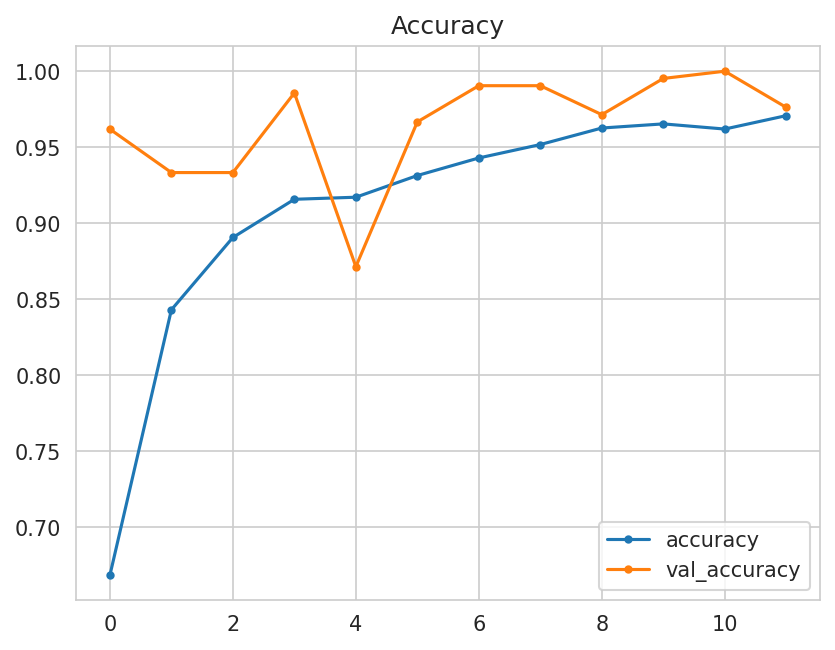
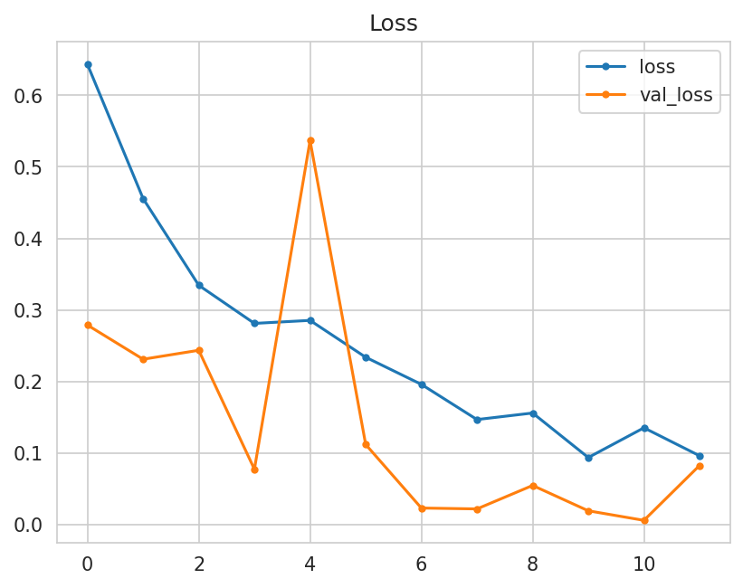
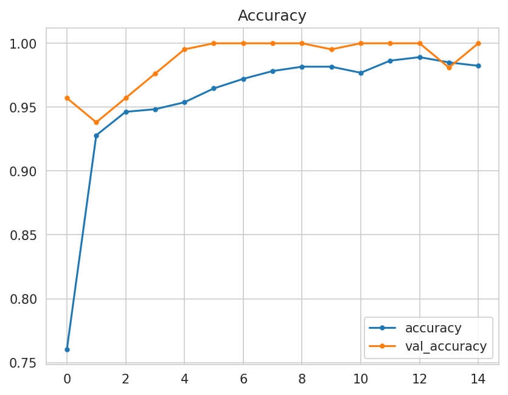
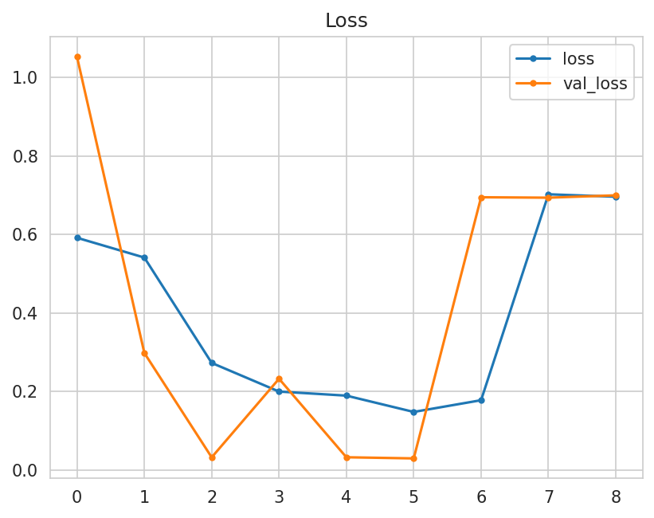

# 

### Deployed web application [Mildew Detection](https://pp5mildewdeiain-8e8f491a1401.herokuapp.com/)

## Table of Contents
1. [Business Requirements](#business-requirements)
2. [Epics](#epics)
3. [User Stories and tasks](#user-stories-and-tasks)
4. [Dashboard Design](#dashboard-design-streamlit-app-user-interface)
5. [The goal](#the-goal)
6. [ML Business Case](#ml-business-case)
7. [Dataset Content (for model v11)](#dataset-content-for-model-v11)
8. [Model (V11)](#model-v11)
9. [Trial and error](#trial-and-error)
10. [Hypothesis and validation](#hypothesis-and-validation)
11. [Manual Testing](#manual-testing)
12. [Bugs](#bugs)
13. [Future development](#future-development)
14. [Deployment](#deployment)
15. [Technologies Used](#technologies-used)
16. [Libraries used](#libraries-used)
17. [Credits](#credits)

## Business Requirements

The cherry plantation crop from Farmy & Foods is facing a challenge where their cherry plantations have been presenting powdery mildew. Currently, the process is manual verification if a given cherry tree contains powdery mildew. An employee spends around 30 minutes in each tree, taking a few samples of tree leaves and verifying visually if the leaf tree is healthy or has powdery mildew. If there is powdery mildew, the employee applies a specific compound to kill the fungus. The time spent applying this compound is 1 minute. The company has thousands of cherry trees located on multiple farms across the country. As a result, this manual process is not scalable due to the time spent in the manual process inspection.

To save time in this process, the IT team suggested an ML system that detects instantly, using a leaf tree image, if it is healthy or has powdery mildew. A similar manual process is in place for other crops for detecting pests, and if this initiative is successful, there is a realistic chance to replicate this project for all other crops. The dataset is a collection of cherry leaf images provided by Farmy & Foods, taken from their crops.

How will the client benefit?
The client will not supply the market with a product of compromised quality.

### Business Requirement 1:

The client is interested in conducting a study to visually differentiate a cherry leaf that is healthy from one that contains powdery mildew.

### Business Requirement 2:

The client is interested in predicting if a cherry leaf is healthy or contains powdery mildew.

### Business Requirement 3:

We agreed with the client to a degree of 97% accuracy.

### Business Requirement 4:

The client is interested in obtaining a prediction report of the examined leaves.

### Business Requirement 5:

#### Dashboard should contain:

- A project summary page
- A page listing your findings related to a study to visually differentiate a cherry leaf that is healthy from one that contains powdery mildew
- A page containing ;
  - A link to download a set of cherry leaf images for live prediction
  - A User Interface with a file uploader widget
  - A table with the image name and prediction results, and a download button to download the table
- A page indicating your project hypothesis
- A technical page displaying model performance

## Epics:

1. Information Gathering and Data Collection:

   - Importing images from a dataset using [Kaggle](https://www.kaggle.com/)

2. Data Visualization, Cleaning, and Preparation:

    - Preparing the data for the model :
        - clean the data and insure there are no double images
        - split the images into train, validate and test sets
        - Argument the images

3. Model Training, Optimization, and Validation:

    - Teach the model using various different means trough trial and error to find the best outcome to meet the business requirements

4. Dashboard Planning, Designing, and Development:

    - Create a dashboard that is user friendly and easily readable

5. Dashboard Deployment and Release:

    - Deploy the dashboard so that is more easily accessible to the end user

## User Stories and tasks:

Information Gathering and Data Collection:

 - User Story: As a data analyst/developer, I can download the dataset needed from Kaggle
    - Task: Download the zip folders from Kaggle .

Data Visualization, Cleaning, and Preparation:

 - User Story: As a data analyst/developer, I can clean the data and remove all duplicate images as well as remove all relevant images and data

 - User Story: As a data analyst/developer, I can prepare the data into the correct steps to  use to train the ml model

     - Task: Split the data into train, validation and test sets
     - Task: Resized all the images
     - Task: Get the mean and variability of images per label
     - Task: Count of how many images there are in the tarin, test and validation sets
     - Task: Augmented training and validation images

Model Training, Optimization, and Validation:

 - User Story: As a data analyst/developer, I can train a model to have good accuracy but at the same time have good performance
 - User Story: As a data analyst/developer, I can insure the model meets the minimum accuracy requirements

     - Task: Create and train a model with multiple convolutional layers.
     - Task: find the best optimizers and parameters to meet the business requirements of 97% accuracy.
     - Task: Test the Models performance.

Dashboard Planning, Designing, and Development:

 - User Story: As a data analyst/developer, I can create a user friendly dashboard that can be interacted with.
 
 - User Story: As a data analyst/developer, I can develop a dasboard that meets the business requirements

     - Task: Create the pages as agreed upon the business requirements
     - Task: Display the data to the user in an easily readable format
     - Task: Must be user friendly dashboard and should not leave the user with any confusion or navigation issues

Dashboard Deployment and Release:

 - User Story: As a data analyst/developer, I can deploy the project so that it is easily accessible to the users
     - Task: Deploy the final project.

## Dashboard Design (Streamlit App User Interface)

### [Streamlit](https://streamlit.io/) was used to create the dashboard for easy uses and present data

#### Page One: Project Summary

The project summary page is the landing page, it is the first page you will see.
It in detail explains the General information, Project dataset and Business requirements.

#### Page Two: Cherryleaves Visualizer

On this page you can see the differences between average healthy and powdery-mildew leaves as well as an image montage of healthy or powdery-mildew leaves.

#### Page Three: Powdery mildew detection

On this page you can download a photo from the link provided or if you have a picture of a cherry leaf you can drag and drop it onto the page, it will then give you a prediction of the leaf with an option to download a report of the prediction.

#### Page Three: Hypothesis

Here you will find a hypothesis of how to identify a healthy cherry leaf from a powdery-mildew leaf

#### Page Three: Ml Performance Metrics

This page has the performance of the model been used for the dashboard going into depth about the model and the performance of it.

## The goal

The goal is to meet all the business requirements as well as display it in a format that is easily readable to anyone using the dashboard but as well as have a section for users who are more interested of the indepth results of the model

## ML Business Case

- The outcome of this project should help farmers predict infected cherry leaves from uninfected ones with a easily usable dashboard and allow them to download the results for future uses.

- The model achieved an accuracy of 99% or above on the test set.

- The model will predict whether a leaf is infected or not at a very fast speed allowing the farmer to check many leaves in a short time frame with a very high accuracy.

- The diagnostics of the outcome should be easily readable and understandable by any farmer who knows how to use the ml model

- The training data will be downloaded from [kaggle](https://www.kaggle.com/datasets/codeinstitute/cherry-leaves)

- Train data - To train a model to identify whether a cherry leaf is infected or not
## Dataset Content (for model v11)

1. The data was gathered from [kaggle](https://www.kaggle.com/datasets/codeinstitute/cherry-leaves) and downloaded into zip folders that consisted of healthy leaf photos as well as powdery-mildew photos.
I then proceeded to unzip the folders first clean the data to insure I only have images and then deleted fifty percent of the data from both files and this was the result of the image count

   - Folder: healthy - has 2104 image files
   - Folder: healthy - has 0 non-image files
   - Folder: powdery_mildew - has 2104 image files
   - Folder: powdery_mildew - has 0 non-image files
   - Folder: healthy - Deleted 1052 images based on 50% deletion.
   - Folder: powdery_mildew - Deleted 1052 images based on 50% deletion.
   - Folder: healthy - has 1052 images remaining
   - Folder: powdery_mildew - has 1052 images remaining

2. I split the data into train, validation and test sets as follows

   - The training set is divided into a 0.70 ratio of data.
   - The validation set is divided into a 0.10 ratio of data.
   - The test set is divided into a 0.20 ratio of data.

3. I then resized all the images

   - Mean width of images: 256
   - Mean height of images: 256

4. I then got the mean and variability of images per label

   - 

     
mean and variability:

     
     
     

     

5. I do a count of how many images there are in the tarin, test and validation stes.
   The count is as follow

   - Train - healthy: 736 images
   - Train - powdery_mildew: 736 images
   - Validation - healthy: 105 images
   - Validation - powdery_mildew: 105 images
   - Test - healthy: 211 images
   - Test - powdery_mildew: 211 images
   - 

     
Bar graph displaying the amount of images in each set:

     

     

6. I then augmented training and validation images in hopes the model will pick up on more patterns of the leaves.
   An example of this would look like this:

   - 

     
Example of Augmented images

     

     

## Model (V11)

The model shows rapid improvement for both loss and accuracy within the first few epochs, the model then archives and maintains high accuracy and low loss indicating effective learning and good generalization without
overfitting

Here is a Graph of the model

**Loss**

  - The model shows a rapid reduction in training and validation losses in the first few epochs indicating that the model is learning effectively
  - The model losses then remains close to zero after the first few epochs showing that the model in not overfitting
  - The model losses stabilizes but there are some signs of fluctuation which indicates some overfitting but not significant enough for me to deem this model not acceptable
  - Overall the model demonstrates excellent performance with low value losses
  - 

    
Here is a Graph pf the models training losses

    

    

**Accuracy**

  - The model shows rapid increase in accuracy in both validation and training within the first few epochs
  - There is no significant overfitting as the model stabilizes quickly with high accuracy
  - The close alignment of both training and validation suggest good performance of the model
  - Overall the model shows excellent accuracy and high performance as well as maintaining this throughout the process
  - 

    
Here is a Graph of the models training accuracy

    

    

**Confusion Matrix**

Here we can see the model is highly accurate, correctly predicting a vast majority of instances in both classes. There are very few errors (Only two false negatives and no false positives)

 - 

    
Here is the Confusion Matrix results

    

    

**Optimizer**

I used SGD as the optimizer for this model as I have found better results using it, this the code I used.
For the loss I went wit binary_crossentopy with metrics as accuracy

  - 

    
Code Snippet of optimizer

    

    

**Model Code explanation**

- For this model(v11) I have used five convolutional layers starting off with 16 filters increasing in size. I found that this would stabilize the model.
- This model has a dropout set to 0.5 which prevents too much overfitting or underfitting of this model
- A batch size of one was used
- Patience was set to 3 to insure the model would stop at the right time to prevent overfitting
- This model dense was set at 128 I found better performance at this value

 - 

    
Code Snippets of the model

    
    
    

    

## Trial and error

When creating this model it did not come without complication (Overfittin And underfitting) this is the eleventh model through trial and error. This is the only way I have to achieve these results. I have used three different optimizers Adam, RMS prop and SGD.
I have also used different patience values, density values as well as different convolutional lairs.

At first I ran a few models but found I didn't really understand how the model was performing in regards to the relation to accuracy and value loss as well as what classes it should improve on to solve this I have added more graphs to display the results in a better more readable way for me to see what the model is actually doing and how I could improve on it.

Here is how each model performed :

  - 

    
v1

    
    

    

  - 

    
v2

    
    

    

  - 

    
v3

    
    

    

  - 

    
v4

    
    
    

    

  - 

    
v5

    
    
    

    

  - 

    
v6

    
    
    
    

    

  - 

    
v7

    
    
    
    

    

  - 

    
v8

    
    
    
    

    

  - 

    
v9

    
    
    
    

    

  - 

    
v10

    
    
    
    

    

  - 

    
v11

    
    
    
    

    

   
## Hypothesis and validation

The model is well tuned and effectively balanced

It simultaneously shows a decrease and low final values for both validation and training losses, alongside with close alignment of the curves

The model has successfully learned the patterns in the training set and can generalize these patterns to unseen validation data without overfitting

The model has a general performance of 99.53%

# 

# Manual Testing

| What was tested | Result | Outcome |
|:---:|:---:|:---:|
|Clicked on the radio buttons in the menu|Changed to the desired page|Works as intended|
|Clicked the close button on the menu|Hides the menu|Works as intended|
|Clicked the links on every page |directs you to the desired page|Works as intended|
|Clicked on all three check boxes|displayed intended content|Works as intended|
|Clicked on all options in the image montage dropdown|displayed intended content|Works as intended|
|Dragged and dropped a image on designated area|Predicted the images correctly|Works as intended|
|Clicked on the download report link| Open a excel spreadsheet with the report|works as intended|
|Dragged and dropped more than one image|Predicts images correctly |works as intended|

## Bugs

1. On model v5 there is a bug where the confusion matrix does not display correctly as this was the first implementation of it I did and fixed it for future models
 - 

    
Here you can see it is displaying incorrectly (Model v5)

   
    

    

2. I would not describe this as a bug but as an issue that can be attended to in the future, I found every time I made a new model I could have created a global variable where I can change the version on one place rather than have to change it individually at multiple different places

## Future development

For future development there are a few ideas that could be considered:

1. Create a dropdown to not only identify cherry leaves but as well as other crops for the farmer
2. Create database when multiple users start logging on and using the web application it will grow the database and in return train the model more effectively
3. Create a heatmap of the infected crops of farmers so that farmers can see what is happening in their surrounding areas
 
## Deployment

### Heroku

- The App live link is: `https://YOUR_APP_NAME.herokuapp.com/`
- Set the runtime.txt Python version to a [Heroku-20](https://devcenter.heroku.com/articles/python-support#supported-runtimes) stack currently supported version.
- The project was deployed to Heroku using the following steps.

1. Log in to Heroku and create an App
2. At the Deploy tab, select GitHub as the deployment method.
3. Select your repository name and click Search. Once it is found, click Connect.
4. Select the branch you want to deploy, then click Deploy Branch.
5. The deployment process should happen smoothly if all deployment files are fully functional. Click the button Open App on the top of the page to access your App.
6. If the slug size is too large, then add large files not required for the app to the .slugignore file.

## _Cloning the GitHub repository_

This will download a full copy to your desktop

1. Log into GitHub
2. Find the repository you wish to clone
3. Find the green code button top right corner
4. Select "Local", copy the HTTPS URL
5. Go to Codeanywhere and navigate to "New Workspace"
6. Paste the URL into the space provided
7. Click "Create"

## _Forking the GitHub repository_

Will allow you to create a copy of the repository so changes can be made that will not affect the original repository.

1. Log into GitHub
2. Find the repository you wish to fork
3. Find the "Fork" drop down in the top right corner second from last
4. Select "Create"  

# Technologies Used

- [Python](https://www.python.org/) language
- [Markdown](https://en.wikipedia.org/wiki/Markdown) language
- [Heroku](https://en.wikipedia.org/wiki/Heroku) for deploy of this project
- [Jupiter Notebook](https://jupyter.org/) to edit and create code for the model
- [Kaggle](https://www.kaggle.com/) to download dataset images
- [GitHub](https://github.com/): storing files online and for deployment
- [Gitpod](https://www.gitpod.io/) to write the code
- [Snipping Tool](https://freesnippingtool.com/download) to create sniped images
- [amiresponsive](https://ui.dev/amiresponsive) to check responsiveness

# Libraries used

- [numpy](https://numpy.org/doc/stable/) converting to array
- [pandas](https://pandas.pydata.org/pandas-docs/stable/) creating/saving as dataframe
- [matplotlib](https://matplotlib.org/stable/contents.html) plotting the sets
- [seaborn](https://seaborn.pydata.org/) confusion matrix
- [plotly](https://plotly.com/python/)  model learning curve
- [streamlit](https://docs.streamlit.io/) creating the dashboard
- [scikit-learn](https://scikit-learn.org/stable/user_guide.html) evaluating the model
- [tensorflow-cpu](https://www.tensorflow.org/versions/r2.0/api_docs/python/tf) creating the model
- [keras](https://keras.io/api/) setting the model hyperparameters

# Credits

- Code Institute for the learning content provided
- MO Shami my assigned mentor to give advise on the project
- Nicole Jackson my wife a student at code institute for constructive criticism
- Slack community
- Code Institute walkthrough project 5 malaria detection
- [stackoverflow](https://stackoverflow.com/)
- [chatgpt](https://openai.com/index/chatgpt/)
- [Underfitted](https://www.youtube.com/watch?v=H2M3fT1njXQ)
- [cla-cif
](https://github.com/cla-cif/Cherry-Powdery-Mildew-Detector?tab=readme-ov-file#the-process-of-cross-industry-standard-process-for-data-mining)
- [tomdu3](https://github.com/tomdu3/brain-tumor-detector)

